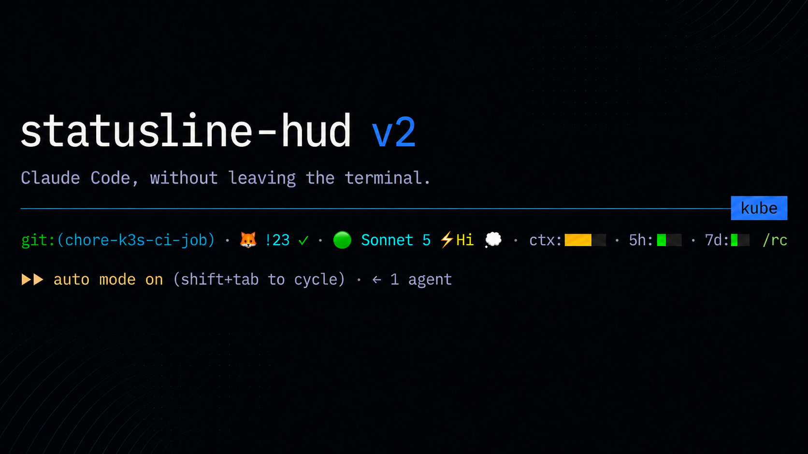

# statusline-hud



A power meter for Claude Code. One bash script. Renders git state, MR/PR and pipeline status, model + effort, context window, rate limits, and lines changed into a single status line — with cache hit ratio and session spend a one-line config change away.


## What it shows

Left to right (segments marked *off* are in the script but disabled in the default `SEGMENTS`):

- **Directory** (*off*) — last two path segments (with `$HOME` shown as `~`)
- **Git** — branch, `↑N↓N` ahead/behind, `✗` if dirty
- **Lines changed** `+156 −23` — this session's edits, from `cost.total_lines_*`; hidden while both are zero
- **Model** — display name (Opus `(1M context)` collapses to `(1M)`)
- **Effort badge** — `⚡Lo` / `⚡Med` / `⚡Hi` / `⚡xHi` / `⚡Max`, only on models that expose the knob
- **Fast-mode rocket** 🚀 when `/fast` is active; **💭** when extended thinking is on
- **Context-window bar** — green → yellow (≥30%) → orange (≥50%) → red (≥60%)
- **5-hour rate-limit bar** — your burst quota; green → yellow (≥60%) → orange (≥80%) → red (≥95%)
- **7-day rate-limit bar** — the limit that actually locks you out for the week; same colour tiers as 5h
- **Reset countdown** `↺2h14m` — only shown when a rate-limit bar climbs above 60%
- **Session name** (*off*) — from `--name`, `/rename`, or the AI-generated title; truncated at `SESSION_MAX` (24)
- **Worktree** (*off*) `⎇ my-feature` — only inside a linked git worktree, so you know a subagent moved you
- **Cache hit ratio** (*off*) `↩97%` — from `prompt_cache.hit_ratio` (Claude Code ≥ 2.1.251, session-wide); green ≥60%, amber 30–59%, red below. Flips to cyan `❄97%` when the cached prefix has gone cold — the next turn re-caches everything. While still warm, `↩97% ❄4m` appears once fewer than `CACHE_EXPIRY_WARN_MIN` (10) minutes of TTL remain: send a message before then and the prefix stays cached instead of being rewritten (`recache_tokens_if_cold` tokens — tens of thousands on a long session). Older versions fall back to per-turn maths, shown only when input tokens > 5k
- **MR/PR badge** — the merge request / pull request for the current branch. On Claude Code ≥ 2.1.234 it comes straight from the payload's `pr` field (no CLI, no network, no cache); `review_state` maps to `✓` approved, no glyph pending, `✗` changes requested, `✎` draft. When `pr` is absent — no open PR, or it has merged/closed — the script falls back to `glab`/`gh`, chosen from the remote host (`origin`, else the branch's upstream, else the first remote): `🦊 !23 ✓` / `🐙 #42 ✓` mergeable (green), `✗` conflicts (red), no glyph while checks are pending or the PR is blocked/behind (yellow), `✎` draft (grey), `⇄` merged (purple).
- **Pipeline dot** — latest pipeline/run for the branch, Cmd-clickable to it: 🟢 passed · 🔴 failed · 🟡 running · ⚪ pending/queued · ⚫ cancelled · ⏭ skipped · ✋ manual. Shows ⚪ when the newest pipeline is for an older commit than your local HEAD (its result isn't about the code you're looking at — push, or wait for the new run). GitLab via `glab ci get`, GitHub via `gh run list`; same background cache as the MR badge. Cmd/Ctrl-click opens the MR in terminals that support OSC 8 hyperlinks (Ghostty, iTerm2, Kitty, WezTerm). When clickable, the `!23` ref is shown in link-blue (`C_MR_LINK=39`); add `MR_LINK_STYLE=4` for an underline too. Lookups run in the background and are cached per repo+branch for 60s, so a render never waits on the network. Hidden when the matching CLI isn't installed or the branch has no pipeline
- **Session totals** (*off*) 🔥 — cumulative session spend in USD (default), straight from `cost.total_cost_usd`, with the burn rate `($3.20/h)` alongside once the session is 30s old. Green under $5, amber $5–$20, red ≥ $20 (tuned for Max-plan users). Flip `TURN_UNIT=tokens` for input-token count instead, `TURN_RATE=0` to drop the rate; tweak `TURN_HI_USD` / `TURN_MED_USD` (or `_TOK` equivalents) to shift the thresholds.

**Preview it before installing:** `bash statusline-hud.sh --demo` renders a sample payload with every segment on.

Each bar is five cells (20% per cell) with eight sub-step glyphs (`▏▎▍▌▋▊▉█`) so the fill advances smoothly within a cell rather than jumping a whole 20% at a time. The whole bar takes one colour from its current tier — there's no per-cell gradient.

## Install

### As a plugin (recommended)

```
/plugin marketplace add newell-paul/statusline-hud
/plugin install statusline-hud@statusline-hud
/statusline-hud
```

The `/statusline-hud` skill symlinks `~/.claude/statusline-hud.sh` into the plugin, creates `~/.claude/statusline-hud.conf` for your overrides, and wires `settings.json` — offering to install `jq` if it's missing. Plugins can't set `statusLine` themselves, hence the symlink. After `/plugin update` a SessionStart hook re-points the symlink, so updates apply on the next session with nothing to re-run; your settings live in the conf file. If you install the plugin and never run the skill, the hook nudges you once. Say "preview statusline" to see it before wiring, "configure statusline" to change settings, or "uninstall statusline" to remove it.

### By hand

**1.** Install `jq` if you don't already have it (`jq --version` to check):

```sh
brew install jq              # macOS
sudo apt install jq          # Debian/Ubuntu
```

**2.** Copy the script into `~/.claude/`:

```sh
mkdir -p ~/.claude
cp statusline-hud.sh ~/.claude/statusline-hud.sh
chmod +x ~/.claude/statusline-hud.sh
```

**3.** Wire it into `~/.claude/settings.json` (create the file if it doesn't exist):

```json
{
  "statusLine": {
    "type": "command",
    "command": "~/.claude/statusline-hud.sh"
  }
}
```

If `settings.json` already has other top-level keys, merge the `statusLine` block in alongside them.

Optional: add `"refreshInterval": 30` inside the `statusLine` block to also re-render on a timer. Claude Code otherwise only re-runs the script on events (new assistant message, `/compact`, a rate-limit reset), so the git and MR/PR segments can go stale while the session idles — e.g. a subagent switching branches, or an MR getting merged while you wait. The rate-limit bars themselves only refresh with an API response; the timer keeps everything else current.

The `SEGMENTS` array in the CONFIG block controls what shows and in what order (defaults below; commented entries are off). Set your own list in `~/.claude/statusline-hud.conf`, e.g. `SEGMENTS=(git model ctx rl5)`.

```bash
SEGMENTS=(
  # dir         # current working directory
  git         # branch name, ahead/behind, dirty marker
  lines       # lines added / removed this session (+156 −23)
  mr          # GitLab MR / GitHub PR badge for the current branch (glab / gh)
  ci          # latest pipeline for the branch as a traffic-light dot (glab / gh)
  model       # model name + effort badge
  ctx         # context-window usage bar
  rl5         # 5-hour rate-limit bar with reset countdown
  rl7         # 7-day rate-limit bar with reset countdown
  # session     # session name (from --name, /rename, or the AI title)
  # worktree    # ⎇ worktree name when inside a linked git worktree
  # cache       # session-wide cache-hit ratio (❄ when cold)
  # turn        # the flame 🔥 — cumulative session tokens or USD
)
```

**4.** Restart Claude Code (or open a new session). The bar appears.

## Uninstall

Plugin install: say "uninstall statusline" (the skill removes the script, conf, and `statusLine` block), then `/plugin uninstall statusline-hud@statusline-hud`.

By hand:

```sh
rm ~/.claude/statusline-hud.sh ~/.claude/statusline-hud.conf
```

Then remove the `statusLine` block from `~/.claude/settings.json`.

## Configuration

The script reads JSON from stdin and renders one line. All settings — colours, thresholds, segment order, per-turn unit — are defined in the CONFIG block near the top of the script. Override them in `~/.claude/statusline-hud.conf`, which the script sources after the CONFIG block using the same bash assignment syntax:

```bash
SEP_CHAR=" | "
MR_LINK_STYLE=4
SEGMENTS=(dir git mr ci model ctx rl5 rl7)
```

Keep edits in the conf file rather than the script so a plugin update (or a fresh `cp`) doesn't wipe them. There are no env-var knobs.

Notable settings:

- **`NERD_FONT`** — `1` swaps the emoji for Nerd Font glyphs: Octocat and tanuki MR prefixes, coloured pipeline icons. Only glyphs you haven't overridden are swapped. Ghostty renders these out of the box; other terminals need a Nerd Font selected.
- **`TURN_UNIT`** — `usd` (default) shows the 🔥 segment as cumulative session spend in dollars. `TURN_RATE=1` (default) appends the burn rate. Flip to `tokens` for current-context input-token count instead. Note: as of Claude Code v2.1.132, `total_input_tokens` reflects the live context window (drops after `/compact`), not cumulative session totals — so the `tokens`-mode thresholds (`TURN_MED_TOK=120000` / `TURN_HI_TOK=160000`) are tuned as fractions of a 200k context, not session totals. Raise them if you run a 1M-context model.
- **`SEGMENTS`** — which segments render and in what order. Set the full list in the conf file; anything left out is hidden (e.g. `SEGMENTS=(git mr ci model ctx rl5 rl7 lines cache turn)` to turn everything on).
- **`MR_PREFIX_GITLAB` / `MR_PREFIX_GITHUB`** — text before the MR/PR number. Defaults `"🦊 !"` and `"🐙 #"`. Try `"!"` / `"#"` for bare notation, `"MR "` / `"PR "`, or a Nerd Font logo if your terminal renders private-use glyphs in the status row.
- **`MR_LINK_STYLE` / `C_MR_LINK`** — SGR attribute (`0` none — default; `4` underline, `1` bold) and colour (default `39` link-blue; `""` keeps the state colour) applied to the `!N` ref when the MR badge is a clickable link.
- **`CI_PASS` … `CI_MANUAL`** — the seven pipeline-dot glyphs, if you'd rather have `✔`/`✘` than traffic lights.
- **`MR_TTL` / `MR_CACHE_DIR`** — how long (seconds) an MR/PR or pipeline lookup is reused before a background refresh, and where the per-branch cache files live (`/tmp/statusline-hud-$UID` by default).
- **`CACHE_EXPIRY_WARN_MIN`** — minutes of remaining cache TTL below which the `❄Xm` countdown appears next to a warm cache ratio (default 10; `0` hides it).
- **`BAR_CTX` / `BAR_LINEAR`** — three tier-boundary percentages controlling when each bar flips colour (green → yellow → orange → red).

Colours are xterm-256 indices (0–255), not 16-colour ANSI, so they're fixed rather than tracking your terminal theme. Override the `C_*` values in the conf file to retheme.

### Your own segments

The conf file is sourced bash, so a `seg_<name>()` function defined there is a segment like any other. Print what you want shown (ANSI is fine); print nothing to hide it.

```bash
seg_k8s() { printf "\033[38;5;39m⎈ %s\033[0m" "$(kubectl config current-context 2>/dev/null)"; }
SEGMENTS=(dir git k8s model ctx rl5 rl7)
```

No runtime, no plugin API, no rebuild.

## Compatibility

- Requires `bash`, `jq`, `awk`, `git`, `date`. All present on a default macOS or Linux install once `jq` is added. The `mr` and `ci` segments additionally need [`glab`](https://gitlab.com/gitlab-org/cli) for GitLab remotes or [`gh`](https://cli.github.com) for GitHub remotes, and is skipped without the matching CLI. Self-hosted works out of the box: a `github.com` remote picks `gh`, any other host picks `glab`, and each CLI resolves the instance from the remote URL and uses the token you gave it with `glab auth login --hostname …` / `gh auth login --hostname …`. No URL is configured in the script. A Bitbucket, Gitea or Azure DevOps remote falls into the `glab` path, fails quietly, and hides the two segments.
- Tested on Claude Code 2.1.x; the contract fixture was recorded on 2.1.251.
- Status fields the script consumes: `model.display_name`, `workspace.current_dir` / `cwd`, `effort.level`, `fast_mode`, `context_window.used_percentage`, `context_window.total_input_tokens`, `context_window.current_usage.cache_read_input_tokens`, `cost.total_cost_usd`, `rate_limits.five_hour.used_percentage` + `resets_at`, `rate_limits.seven_day.used_percentage` + `resets_at`, `prompt_cache.hit_ratio` + `warm` + `expires_at`, `thinking.enabled`, `cost.total_lines_added` + `total_lines_removed` + `total_duration_ms`, `session_name`, `workspace.git_worktree` / `worktree.name`, `pr.number` + `url` + `review_state` + `kind`.
- Every segment except `mr` and `ci` is a pure function of stdin. Those two keep small per-branch cache files under `MR_CACHE_DIR` (created `0700`) so they can answer instantly and refresh `glab`/`gh` in the background; `mr` skips the CLI entirely when the payload carries `pr`.

## Tests

```sh
brew install bats-core
bats tests/
```

178 tests cover bars, effort levels, the 💭 thinking badge, the lines-changed, session and worktree segments, burn rate, `NERD_FONT`, conf-defined segments, `--demo`, the SessionStart hook, git states, reset countdowns, cache ratios, the cold-cache ❄ flip and expiry countdown, the MR/PR badge and pipeline dot (native `pr.*` field, fake `glab`/`gh` on PATH, remote-host detection, GitHub state normalisation, HEAD-sha mismatch, cache freshness, per-branch keys), the session-cumulative cost/token segment, malformed input, and a recorded JSON contract. The contract test fails if Anthropic adds, renames, removes, or changes the type of any field in the recorded fixture (`tests/fixtures/real-opus.json`).

To refresh the contract after an intentional schema change: `./tests/regen-schema.sh`.

## Writeup

I wrote up the why and the broader behavioural angle here: [blog/statusline-blog.md](blog/statusline-blog.md).

## License

MIT
