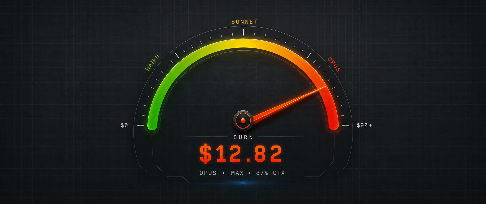
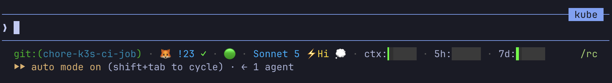

# statusline-hud



A power meter for Claude Code. One bash script. Renders model, effort, context window, rate limits, cache hit ratio, and cumulative session spend into a single status line.



## What it shows

Left to right:

- **Directory** — last two path segments (with `$HOME` shown as `~`)
- **Git** — branch, `↑N↓N` ahead/behind, `✗` if dirty
- **Model** — display name (Opus `(1M context)` collapses to `(1M)`)
- **Effort badge** — `⚡Lo` / `⚡Med` / `⚡Hi` / `⚡xHi` / `⚡Max`, only on models that expose the knob
- **Fast-mode rocket** 🚀 when `/fast` is active
- **Context-window bar** — green → yellow (≥30%) → orange (≥50%) → red (≥60%)
- **5-hour rate-limit bar** — your burst quota; green → yellow (≥60%) → orange (≥80%) → red (≥95%)
- **7-day rate-limit bar** — the limit that actually locks you out for the week; same colour tiers as 5h
- **Reset countdown** `↺2h14m` — only shown when a rate-limit bar climbs above 60%
- **Cache hit ratio** `↩97%` — from `prompt_cache.hit_ratio` (Claude Code ≥ 2.1.251, session-wide); green ≥60%, amber 30–59%, red below. Flips to cyan `❄97%` when the cached prefix has gone cold — the next turn re-caches everything. Older versions fall back to per-turn maths, shown only when input tokens > 5k
- **MR badge** — the GitLab merge request for the current branch via `glab`: `!23 ✓` mergeable (green), `!23 ✗` conflicts (red), `!23` pipeline still checking (yellow), `✎ !23` draft (grey), `⇄ !23` merged (purple). Lookups run in the background and are cached per repo+branch for 60s, so a render never waits on the network. Hidden when `glab` isn't installed or the branch has no MR
- **Session totals** 🔥 — cumulative session spend in USD (default), straight from `cost.total_cost_usd`. Green under $5, amber $5–$20, red ≥ $20 (tuned for Max-plan users. Flip `TURN_UNIT=tokens` for input-token count instead; tweak `TURN_HI_USD` / `TURN_MED_USD` (or `_TOK` equivalents) to shift the thresholds.

Each bar is five cells (20% per cell) with eight sub-step glyphs (`▏▎▍▌▋▊▉█`) so the fill advances smoothly within a cell rather than jumping a whole 20% at a time. The whole bar takes one colour from its current tier — there's no per-cell gradient.

## Install

**1.** Install `jq` if you don't already have it (`jq --version` to check):

```sh
brew install jq              # macOS
sudo apt install jq          # Debian/Ubuntu
```

**2.** Copy the script into `~/.claude/`:

```sh
mkdir -p ~/.claude
cp statusline-hud.sh ~/.claude/statusline-hud.sh
chmod +x ~/.claude/statusline-hud.sh
```

**3.** Wire it into `~/.claude/settings.json` (create the file if it doesn't exist):

```json
{
  "statusLine": {
    "type": "command",
    "command": "~/.claude/statusline-hud.sh"
  }
}
```

If `settings.json` already has other top-level keys, merge the `statusLine` block in alongside them.

The `SEGMENTS` array in the CONFIG block controls what shows and in what order. Comment a line to hide that segment; move lines to reorder.

```bash
SEGMENTS=(
  dir         # current working directory
  git         # branch name, ahead/behind, dirty marker
  model       # model name + effort badge
  ctx         # context-window usage bar
  rl5         # 5-hour rate-limit bar with reset countdown
  rl7         # 7-day rate-limit bar with reset countdown
  cache       # session-wide cache-hit ratio (❄ when cold)
  mr          # GitLab MR badge for the current branch (needs glab)
  turn        # the flame 🔥 — cumulative session tokens or USD
)
```

**4.** Restart Claude Code (or open a new session). The bar appears.

## Uninstall

```sh
rm ~/.claude/statusline-hud.sh
```

Then remove the `statusLine` block from `~/.claude/settings.json`.

## Configuration

The script reads JSON from stdin and renders one line. All settings — colours, thresholds, segment order, per-turn unit — live in the CONFIG block near the top of the script. Edit the file to change behaviour; there are no env-var knobs.

Notable settings:

- **`TURN_UNIT`** — `usd` (default) shows the 🔥 segment as cumulative session spend in dollars. Flip to `tokens` for current-context input-token count instead. Note: as of Claude Code v2.1.132, `total_input_tokens` reflects the live context window (drops after `/compact`), not cumulative session totals — so the `tokens`-mode thresholds (`TURN_MED_TOK=120000` / `TURN_HI_TOK=160000`) are tuned as fractions of a 200k context, not session totals. Raise them if you run a 1M-context model.
- **`SEGMENTS`** — array near the bottom of the CONFIG block listing which segments render and in what order. Comment a line to hide a segment (e.g. `dir`, `rl7`).
- **`MR_TTL` / `MR_CACHE_DIR`** — how long (seconds) a `glab mr view` result is reused before a background refresh, and where the per-branch cache files live (`/tmp/statusline-hud-$UID` by default).
- **`BAR_CTX` / `BAR_LINEAR`** — three tier-boundary percentages controlling when each bar flips colour (green → yellow → orange → red).

Colours are xterm-256 indices (0–255), not 16-colour ANSI, so they're fixed rather than tracking your terminal theme. Edit the colour values in the CONFIG block to retheme.

## Compatibility

- Requires `bash`, `jq`, `awk`, `git`, `date`. All present on a default macOS or Linux install once `jq` is added. The `mr` segment additionally needs [`glab`](https://gitlab.com/gitlab-org/cli) and is skipped without it.
- Tested on Claude Code 2.1.x.
- Status fields the script consumes: `model.display_name`, `workspace.current_dir` / `cwd`, `effort.level`, `fast_mode`, `context_window.used_percentage`, `context_window.total_input_tokens`, `context_window.current_usage.cache_read_input_tokens`, `cost.total_cost_usd`, `rate_limits.five_hour.used_percentage` + `resets_at`, `rate_limits.seven_day.used_percentage` + `resets_at`, `prompt_cache.hit_ratio` + `warm`.
- Every segment except `mr` is a pure function of stdin. `mr` keeps small per-branch cache files under `MR_CACHE_DIR` so it can answer instantly and refresh `glab` in the background.

## Tests

```sh
brew install bats-core
bats tests/
```

103 tests cover bars, effort levels, git states, reset countdowns, cache ratios, the cold-cache ❄ flip, the glab MR badge (fake `glab` on PATH, cache freshness, per-branch keys), the session-cumulative cost/token segment, malformed input, and a recorded JSON contract. The contract test fails if Anthropic adds, renames, removes, or changes the type of any field in the recorded fixture (`tests/fixtures/real-opus.json`).

To refresh the contract after an intentional schema change: `./tests/regen-schema.sh`.

## Writeup

I wrote up the why and the broader behavioural angle here: [blog/statusline-blog.md](blog/statusline-blog.md).

## License

MIT
