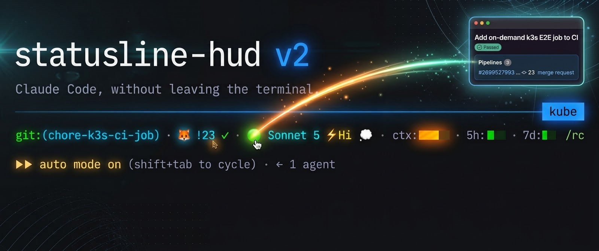
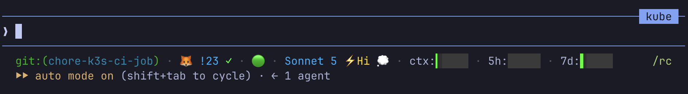
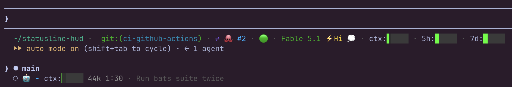

# statusline-hud



A power meter for Claude Code. One bash script renders git state, MR/PR and pipeline status, model and effort, context window and rate limits into a single status line. Cache hit ratio and session spend are a one-line config change away.



## What it shows

Left to right. Segments marked *off* are in the script but not in the default `SEGMENTS`.

- **Directory** (*off*) — last two path segments
- **Git** — branch, `↑N↓N` ahead/behind, `✗` if dirty
- **Lines changed** `+156 −23` — this session's edits
- **MR/PR badge** `🦊 !23 ✓` / `🐙 #42 ✓` — green mergeable, red conflicts, yellow while checks run, `✎` draft, `⇄` merged. Read from the payload on Claude Code ≥ 2.1.234, otherwise via `glab` / `gh`. Cmd-click opens it
- **Pipeline dot** — latest run for the branch: 🟢 🔴 🟡 ⚪ ⚫ ⏭ ✋. ⚪ when the run is for an older commit than your HEAD. Cmd-click opens it
- **Model** — coloured by tier, with `⚡Lo` … `⚡Max` effort badge, 🚀 for `/fast`, 💭 for extended thinking
- **Subagent count** (*off*) `🤖 ×2` — the agent rows already show each one
- **Context bar** — green → yellow (30%) → orange (50%) → red (60%)
- **5-hour and 7-day bars** — green → yellow (60%) → orange (80%) → red (95%), with a reset countdown `↺2h14m` above 60%
- **Session name** and **worktree** `⎇ my-feature` (*off*)
- **Cache hit ratio** (*off*) `↩97%` — cyan `❄` when the cached prefix has gone cold, `❄4m` while it's warm but about to lapse
- **Session spend** (*off*) `🔥 $5.64 ($3.20/h)` — green under $5, amber to $20, red above. `TURN_UNIT=tokens` for input tokens instead

Bars are five cells drawn in eighths, so they move visibly within a tier. Links use OSC 8, which Ghostty, iTerm2, Kitty and WezTerm support; Terminal.app doesn't.

Preview it: `bash statusline-hud.sh --demo`.

## Agent rows



`subagent-statusline.sh`, wired in as `subagentStatusLine`, restyles the rows Claude Code draws under the prompt while subagents run: name, effort badge, the agent's own context bar, tokens, elapsed, and what it's doing right now. ✗ red for a failed agent, ■ grey for a stopped one.

Teammates from the experimental agent-teams feature aren't passed to `subagentStatusLine`, so they keep the stock row.

Preview it: `bash subagent-statusline.sh --demo | jq -r .content`.

## Install

Needs `jq` (`brew install jq` / `sudo apt install jq`). The `mr` and `ci` segments also need `glab` or `gh`, and hide themselves without one.

### As a plugin

```
/plugin marketplace add newell-paul/statusline-hud
/plugin install statusline-hud@statusline-hud
/statusline-hud
```

The skill symlinks the scripts into `~/.claude/`, creates `~/.claude/statusline-hud.conf` for your overrides, and wires `settings.json`. A SessionStart hook re-points the symlinks after `/plugin update`. Say "preview statusline", "configure statusline" or "uninstall statusline" to the skill.

### By hand

```sh
cp statusline-hud.sh subagent-statusline.sh ~/.claude/
chmod +x ~/.claude/statusline-hud.sh ~/.claude/subagent-statusline.sh
```

Then in `~/.claude/settings.json`:

```json
{
  "statusLine": {
    "type": "command",
    "command": "~/.claude/statusline-hud.sh",
    "refreshInterval": 30
  },
  "subagentStatusLine": {
    "type": "command",
    "command": "~/.claude/subagent-statusline.sh"
  }
}
```

`refreshInterval` re-renders on a timer so git and MR state don't go stale while the session idles. `subagentStatusLine` is optional. Open a new session and the bar appears.

To uninstall, remove the scripts and conf from `~/.claude/` and the two blocks from `settings.json`.

## Configuration

Every setting is a plain assignment in the CONFIG block at the top of each script. Override any of them in `~/.claude/statusline-hud.conf`, which both scripts source, so updates never wipe your changes. No env vars.

```bash
SEGMENTS=(git lines mr ci model ctx rl5 rl7)   # what shows, in order; add cache, turn, session, worktree, dir, agents
SEP_CHAR=" | "
MR_LINK_STYLE=4        # underline clickable refs
NERD_FONT=1            # Nerd Font glyphs instead of emoji
TURN_UNIT=tokens       # 🔥 as input tokens instead of USD
```

Colours are `C_*` xterm-256 indices; bar thresholds are `BAR_CTX` and `BAR_LINEAR`; the pipeline glyphs are `CI_PASS` … `CI_MANUAL`. The CONFIG block documents the rest.

### Your own segments

The conf file is sourced bash, so any `seg_<name>()` defined there is a segment. Print what you want shown; print nothing to hide it.

```bash
seg_k8s() { printf "\033[38;5;39m⎈ %s\033[0m" "$(kubectl config current-context 2>/dev/null)"; }
SEGMENTS=(git k8s model ctx rl5 rl7)
```

## Compatibility

Bash 3.2+, `jq`, `awk`, `git`. Tested on Claude Code 2.1.x. A `github.com` remote picks `gh`; any other host picks `glab`, so self-hosted GitLab works with `glab auth login --hostname`. Bitbucket, Gitea and Azure DevOps remotes fail quietly and hide the two forge segments.

Every segment except `mr`, `ci` and `agents` is a pure function of stdin. Those three keep small cache files under `/tmp/statusline-hud-$UID` so a render never waits on the network.

## Tests

```sh
brew install bats-core
bats tests/
```

200 tests, including a recorded JSON contract that fails if Claude Code changes a field the script reads. Refresh it after an intentional change with `./tests/regen-schema.sh`.

## Writeup

The why, and the broader behavioural angle, is a post on dev.to. Its screenshots live in `blog/images/`.

## License

MIT
