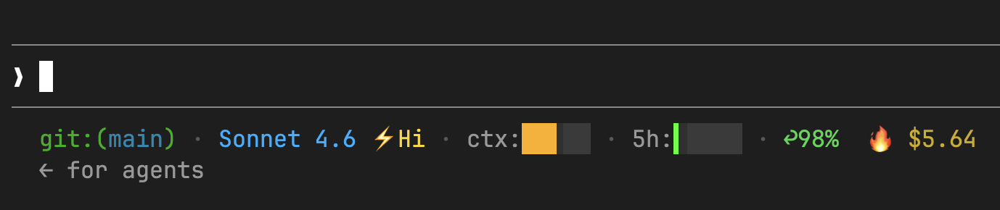
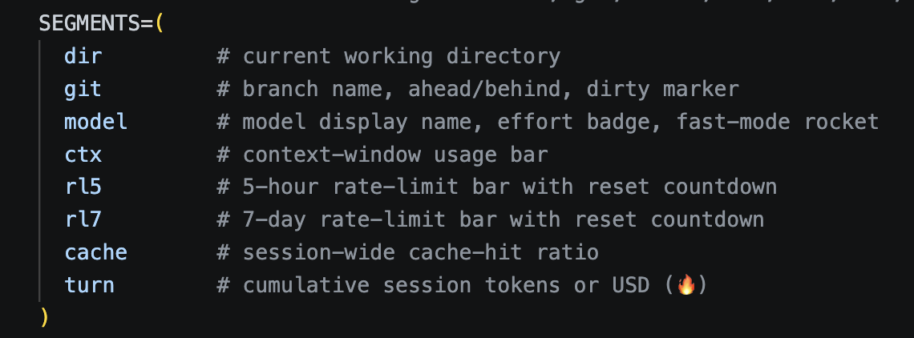

# Claude Code Has a Power Meter. You Just Have to Wire It Up

*One bash script. See what your session costs in dollars. Stop leaving sessions on Opus by accident.*



I kept leaving sessions on Opus long after the hard thinking was done. Claude Code warns you, but context and rate-limit notices flash by and are easy to dismiss.

---

**TL;DR**

1. Grab `statusline-hud.sh` from **[github.com/paulnewell/statusline-hud](https://github.com/paulnewell/statusline-hud)**, drop it in `~/.claude/`, `chmod +x` it.
2. Add a `statusLine` block to `~/.claude/settings.json` (snippet below).
3. Requires `jq` — `brew install jq` or `apt install jq`.


---

## Wire it up

Repo: **[github.com/paulnewell/statusline-hud](https://github.com/paulnewell/statusline-hud)**.

**Prerequisites**

- `jq` on your `PATH`. The script hard-exits with `⚠ jq missing` without it.
- A terminal with 256-colour and UTF-8 support, and a font that renders `🔥 ⚡ ↺ ↩ ✗ ░ █ ▏▎▍▌▋▊▉`. Any modern terminal with a Nerd Font, or the macOS/iTerm2/GNOME defaults, will do.
- macOS or Linux. Native Windows isn't supported; the script is bash and uses POSIX tools (WSL should work, untested).

**Install**

1. Copy `statusline-hud.sh` to `~/.claude/` and make it executable.
2. Add this to `~/.claude/settings.json`:

```json
{
  "statusLine": {
    "type": "command",
    "command": "~/.claude/statusline-hud.sh"
  }
}
```

`refreshInterval` is optional — leave it out and the bar redraws on Claude Code events (prompts, responses, tool calls). Add `"refreshInterval": 5` if you want it to also tick on a timer, for example to keep the countdown accurate while background subagents are running.

The repo has 86 bats tests and a hardened `git_safe()` wrapper that disables `core.fsmonitor` / `core.hooksPath`, so a hostile `.git/config` can't execute code via the bar.

Settings reload; the bar appears on your next interaction.

## The JSON hiding in the statusline

Claude Code's statusline is a shell command that reads a JSON blob on stdin and prints one line of text. Cost, effort, fast mode, cache stats, both rate-limit windows — all already in there, emitted on every render (debounced 300ms). You just need something to show it. (Tap the pipe with `tee` to see the full payload; PAYG and API users will find `rate_limits` absent.)

## What the bar shows

With everything switched on:

- Directory + git status (`↑N↓N`, `✗` if dirty)
- Model name with effort badge (`⚡Lo`…`⚡Max`) and fast-mode rocket 🚀 when `/fast` is active
- Context-window bar: 5 cells using eighths (`▏▎▍▌▋▊▉█`) so the bar moves smoothly within a tier, with the tier colour stepping green → yellow → orange → red
- 5-hour and 7-day rate-limit bars (both shown by default; comment either out in `SEGMENTS`), with reset countdown (`↺2h14m`) appended only at ≥60%
- Cache hit ratio (`↩97%`), only after >5k input tokens
- `🔥` cumulative session spend in USD (or input tokens — see toggle below)

Everything is configurable from the `CONFIG` block at the top of the script.



*The `SEGMENTS` array is your control panel — comment out a line to hide that segment, reorder lines to rearrange the bar. Want git status on the right and the flame on the left? Move the lines.*

Other knobs you'll probably touch:

- `TURN_UNIT`: `usd` (default) shows the flame in dollars; flip to `tokens` for input-token count instead.
- `TIER_COLOR`, `BAR_CTX`, `BAR_LINEAR`: bar palette and the tier thresholds at which each bar flips colour.
- `TURN_HI_USD` / `TURN_MED_USD`: USD thresholds for the flame's amber/red (`TURN_HI_TOK` / `TURN_MED_TOK` for tokens mode).

One `jq` call, a few `git` invocations in a repo. You won't feel it.

## The flame: a session-scale spend gauge

`🔥 $7.42` is the cumulative session spend, read straight from `cost.total_cost_usd`. Green under $5, amber $5–$20, red ≥ $20 — tuned for Max users, where Opus marathons run that high in estimated spend. Red doesn't mean stop; it means *the next routine task is the one to drop to Sonnet for, or `/clear` and start fresh*. PAYG users paying list price should dial down — try `TURN_MED_USD=0.50` / `TURN_HI_USD=2.00`.

The discomfort isn't financial. It's *visible*. Same psychology as a power meter: you don't always read the number, but you notice when it pegs into the red.

Green means I haven't checked the bar in a while and don't need to. Amber means the session has grown legs — fine if I meant it, worth noticing if I didn't. Red means I'm running Opus on a long, heavy context, and it's time to make a choice.

Opus for architecture, complex debugging, ugly refactors. Sonnet for most everyday work. Haiku for routine commands.

On Pro and Max, `cost.total_cost_usd` is an estimate, not your bill — API list rates applied client-side, which can differ from what you're actually billed. Still the best signal for what the flame answers: how much have I put through the model so far? If you'd rather see input tokens, flip `TURN_UNIT=tokens` in the CONFIG block — just be aware that on current Claude Code (post-v2.1.132) `total_input_tokens` reflects *current* context window, not cumulative session totals, and can drop after a `/compact`.

For historical totals, `/usage` gives you the deeper view. The bar nudges in the moment; `/usage` is the rear-view mirror.

Once the bar is in front of you, two habits move the needle:

- Pin routine slash commands to `model: haiku`. Commit, lint, review-diff — none of these need Opus.
- Use subagents for delegation. They get a fresh, isolated context window, not your full history.

The data was always there. Now you can see it.

---

The repo is at **[github.com/paulnewell/statusline-hud](https://github.com/paulnewell/statusline-hud)**. Issues and PRs welcome.